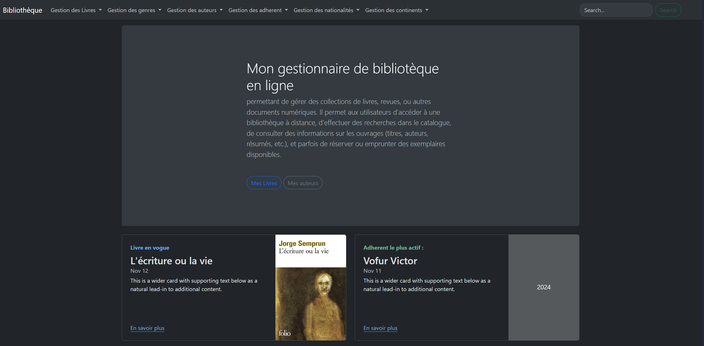

# Petit Gestionnaire de Bibliothèque en Ligne

Ce projet est un **gestionnaire de bibliothèque en ligne** développé en **PHP**. 
Il permet de gérer les livres, les adhérents et les emprunts. 
Ce projet a été réalisé dans le but de mettre en pratique la méthodologie **MVC** (Modèle-Vue-Contrôleur) pour organiser et structurer le code PHP de manière propre et efficace.

## Fonctionnalités

- **Gestion des livres** : Ajouter, modifier, supprimer et lister les livres disponibles dans la bibliothèque.
- **Gestion des adhérents** : Ajouter, modifier, supprimer et lister les adhérents inscrits à la bibliothèque.
- **Gestion des emprunts** : Enregistrer les emprunts de livres par les adhérents, suivre les dates de retour et gérer les livres empruntés.
- **Interface utilisateur intuitive** : Une interface simple pour naviguer entre les différentes sections du gestionnaire de bibliothèque.

## Méthodologie

Le projet suit la méthodologie **MVC** (Modèle-Vue-Contrôleur) qui permet de séparer les responsabilités du code afin de rendre l'application plus maintenable, évolutive et facile à tester :

- **Modèle** : Contient la logique métier et l'accès aux données (par exemple, la gestion des livres, des adhérents et des emprunts).
- **Vue** : Gère l'affichage des données et l'interface utilisateur.
- **Contrôleur** : Ordonne les actions entre le modèle et la vue, gère les requêtes de l'utilisateur.

## Prérequis

- **PHP** (version 7.x ou supérieure)
- **Serveur Web** (Apache, Nginx, ou autre)
- **Base de données** (MySQL ou SQLite)
- **Composer** pour la gestion des dépendances PHP
  

